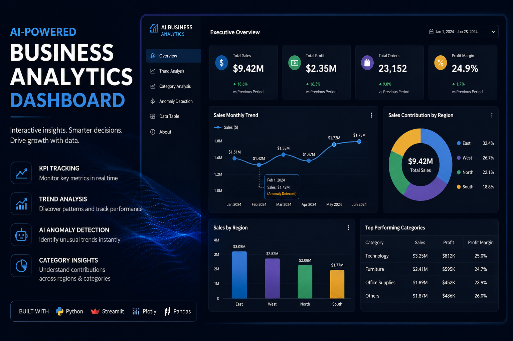
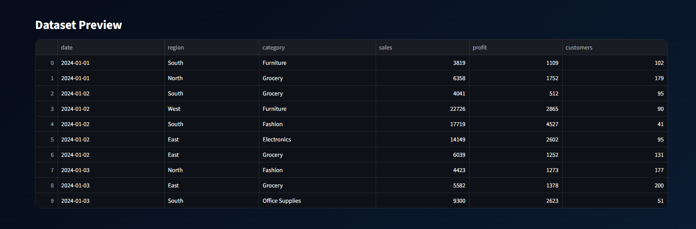
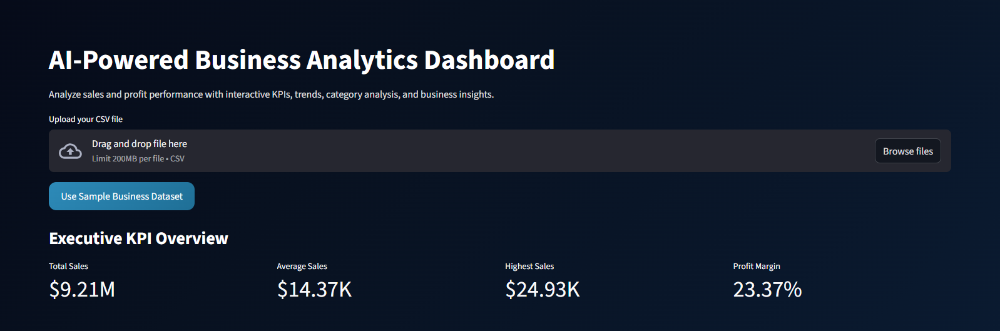
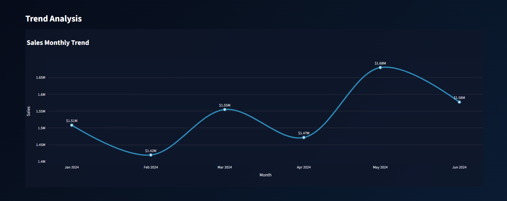
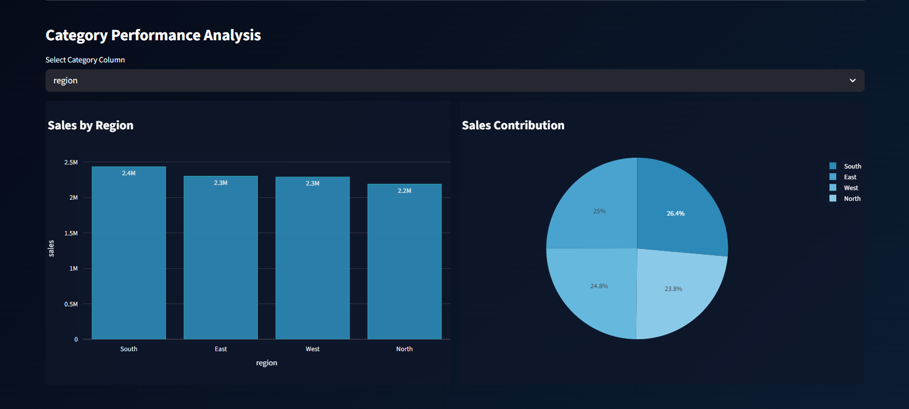
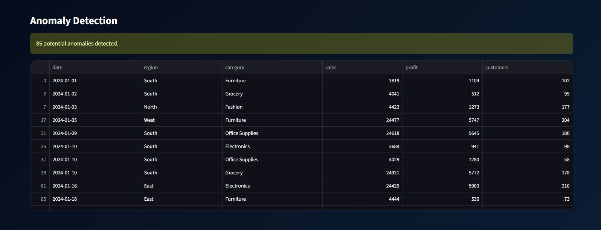
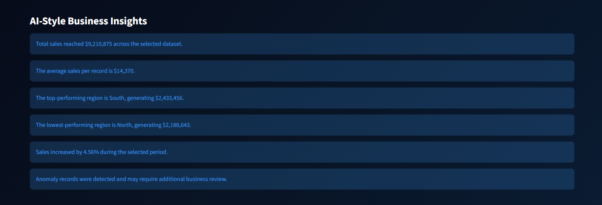

<div align="center">

# AI-Powered Business Analytics Dashboard

Interactive business analytics application for KPI tracking, sales & profit analysis, anomaly detection, and executive dashboard reporting using Python technologies.

[](https://ai-business-analytics-dashboard-fsvu2gr6odbjshe5bdvsgu.streamlit.app/)


</div>

---



---

# Project Overview

The AI-Powered Business Analytics Dashboard is an interactive analytics application built using Python, Streamlit, Plotly, and Pandas.

This project was designed to simulate a modern executive business intelligence dashboard focused on sales and profit analytics, helping users monitor KPIs, identify trends, detect anomalies, and generate actionable business insights through an interactive user experience.

The dashboard combines business analytics, data storytelling, and modern dashboard UI/UX principles into a responsive analytics platform.

---

# Features

- Executive KPI dashboard
- Dynamic Sales & Profit analysis
- Interactive dashboard filtering
- Monthly trend analysis
- Category performance analysis
- Donut contribution analysis
- AI-style business insights
- Anomaly detection system
- Download filtered dataset functionality
- Responsive dark-theme dashboard UI
- Interactive Plotly visualizations
- Dynamic KPI number formatting (K/M/B)

---

# Tech Stack

## Core Technologies
- Python
- Streamlit
- Plotly Express
- Pandas

## Development Tools
- VS Code
- GitHub

---

# Project Structure

```txt
ai-business-analytics-dashboard/
│
├── assets/
│   └── cover_image.png
│
├── sample_data/
│   └── business_sales_dataset.csv
│
├── screenshots/
│   ├── 01_dashboard_overview.png
│   ├── 02_kpi_section.png
│   ├── 03_trend_analysis.png
│   ├── 04_category_analysis.png
│   ├── 05_anomaly_detection.png
│   └── 06_business_insights.png
│
│
├── app.py
├── requirements.txt
├── .gitignore
└── README.md
```

---

# Dashboard Screenshots

## Dashboard Overview


---

## Executive KPI Overview


---

## Monthly Trend Analysis


---

## Category Performance Analysis


---

## Anomaly Detection


---

## AI-Style Business Insights


---

# Key Analytics Capabilities

- Executive KPI Monitoring
- Sales & Profit Tracking
- Trend Analysis & Performance Monitoring
- Category Contribution Analysis
- Interactive Dashboard Filtering
- Automated Anomaly Detection
- Data Storytelling & Insight Generation
- Business Performance Visualization

---

# Skills Demonstrated

- Business Intelligence Dashboard Development
- Data Analytics Workflow Design
- KPI Design & Reporting
- Dashboard UI/UX Design
- Data Visualization
- Python Analytics Development
- Interactive Dashboard Development
- Business Performance Analysis
- Dashboard Storytelling
- Streamlit Application Development

---

# Dashboard Design

The dashboard follows a modern executive analytics design approach using:

- Dark-theme business dashboard styling
- Interactive Plotly visualizations
- Responsive KPI cards
- Smooth trend visualizations
- Consistent portfolio branding
- Modern analytics storytelling principles
- Executive-level dashboard layout design

---

# How to Run the Project

## 1. Clone Repository

```bash
git clone https://github.com/yahya-slmn/ai-business-analytics-dashboard.git
```

---

## 2. Navigate to Project

```bash
cd ai-business-analytics-dashboard
```

---

## 3. Install Requirements

```bash
pip install -r requirements.txt
```

---

## 4. Run Streamlit Application

```bash
streamlit run app.py
```

Application will run on:

```txt
http://localhost:8501
```

---

# Future Improvements

- Predictive analytics & forecasting
- Real-time API integration
- AI-powered recommendations
- Advanced anomaly detection models
- Export dashboard reports
- User authentication system
- Database integration
- Multi-dashboard navigation system

---

# Connect With Me

- LinkedIn: https://www.linkedin.com/in/yahya-sleiman-6b742a356
- GitHub: https://github.com/yahya-slmn
- portfolio: https://yahya-datafolio.netlify.app/
---

# Author

## Yahya Sleiman

Data Analyst | BI Developer | Python Analytics Enthusiast

---

# Repository Notes

This repository is intended for educational, portfolio, and learning purposes.

The sample dataset included in this repository is used for demonstration and dashboard visualization purposes.
